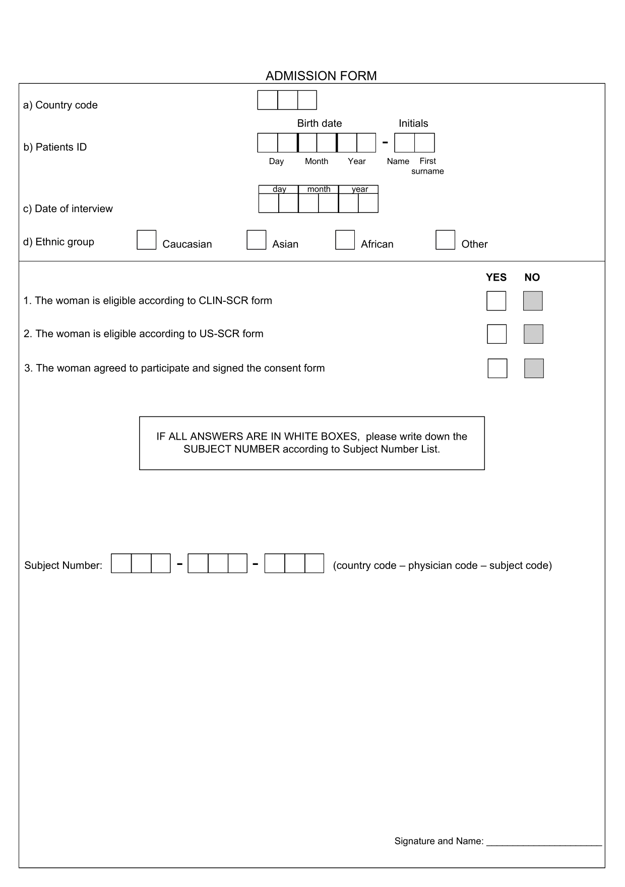

## Introducción

En el marco de un estudio de investigación clínica multicéntrico, se ha recolectado información a través de un formulario dirigido a mujeres mayores de 18 años con el objetivo de implementar estándares internacionales para el crecimiento fetal. Estos estándares permitirán facilitar la detección temprana de alteraciones en el desarrollo del feto durante la gestación.

Dado que la calidad de los datos es fundamental para garantizar la validez de los resultados en estudios clínicos, en este trabajo nos enfocamos en la validación de la base de datos proveniente del formulario. Nuestra tarea como equipo de análisis estadístico consiste en detectar, clasificar y documentar los errores presentes en los datos recolectados. Esto incluye inconsistencias internas, valores imposibles o improbables, datos faltantes, duplicados, y cualquier otro tipo de anomalía que pueda comprometer la calidad del estudio.

El formulario contiene las siguientes preguntas:



## Objetivo

Llevar a cabo un proceso exhaustivo de validación, empleando técnicas para evaluar la calidad de los datos ingresados y detectar errores sistemáticos en el llenado de los formularios.

## Desarrollo

### Reglas de validación

Las reglas de validación que se plantearan para detectar inconsistencias son las siguientes:

-   La fecha de inscripción debe seguir el siguiente formato: dd/mm/yyyy (*Date of interview)*

-   El ID del paciente debe seguir el siguiente formato: dd/mm/yyyy-AA (es decir, *Birth Date + Initials)*

-   Las mujeres deben ser mayores de 18 años (18 years *\< Date of interview - Birth Date \<* 100 years)

-   Los códigos de paises posibles en este estudio son: 4, 11, 14, 23, 31, 48, 54, 65, 72, 97 (*Country code =* 4, 11, 14, 23, 31, 48, 54, 65, 72, 97)

-   Los grupos étnicos deben ser iguales a 1="Caucasico",2=Asiatico",3="Africano" o 4="Otro"(*Ethnic group =* 1,2,3,4)

-   Las preguntas mencionadas en el formulario como 1,2 y 3 deben ser iguales a 1="No" o 2="Si"

-   Si las 3 preguntas anteriores son iguales a 2="Si", entonces la pregunta *Subject Number* debe contener respuesta, en caso contrario debe dejarse en blanco

-   La respuesta de *Subject Number* debe seguir el siguiente formato: <u>0</u> \_ \_ (*country code)* \_ \_ *(physician code = numeric)* \_ \_ \_ (*subject code = numeric*)

-   Adicionalmente se contaran las celdas que esten vacias en cada variable

Y el código para detectar estos errores es el siguiente:

```{r,echo=FALSE}
library(readxl)
adm <- read_excel("adm.xlsx")
```

```{r}
reglas = tribble(
~id, ~descrip, ~cond,
"r1", "(countrycode) es faltante", "is.na(countrycode)",
"r2", "(patientid) es faltante", "is.na(patientid)",
"r3", "(interview) es faltante", "is.na(interview)",
"r4", "(ethnicgroup) es faltante", "is.na(ethnicgroup)",
"r5", "(scr) es faltante", "is.na(scr)",
"r6", "(usscr) es faltante", "is.na(usscr)",
"r7", "(consent) es faltante", "is.na(consent)",
"r8", "(subjectnumber) es faltante", "is.na(subjectnumber)",
"r9", "(ethnicgroup) distinto de 1,2,3 o 4", "ethnicgroup != c(1,2,3,4)",
"r10", "(scr) distinto de 1 o 2", "scr != c(1,2)",
"r11", "(usscr) distinto de 1 o 2", "usscr != c(1,2)",
"r12", "(consent) distinto de 1 o 2", "consent != c(1,2)",
"r13", "(countrycode) distinto de 4, 11, 14, 23, 31, 48, 54, 65, 72 o 97", "countrycode != c(4, 11, 14, 23, 31, 48, 54, 65, 72, 97)"
)

```
