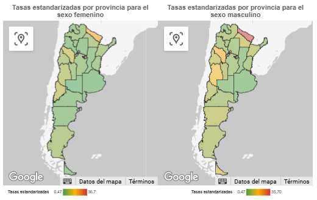

```{r setup, include=FALSE}
knitr::opts_chunk$set(echo = FALSE, message = FALSE, warning = FALSE)
```

## Introducción

La **diabetes mellitus tipo 2 (DM2)** es una afección metabólica caracterizada por niveles persistentemente elevados de glucosa en sangre (hiperglucemia), que resultan de una resistencia a la insulina y una disfunción progresiva de las células beta pancreáticas.

Dicha enfermedad constituye uno de los principales desafíos sanitarios del siglo XXI, tanto a nivel global como en el contexto nacional. Además cabe destacar que la diabetes tipo 2 es la forma más frecuente de esta enfermedad, representando aproximadamente entre el 90% y el 95% de los casos de diabetes diagnosticados en adultos.

<center>

</center>

En este contexto, el análisis de la mortalidad de esta enfermedad adquiere una relevancia fundamental para el diseño de políticas públicas en salud. A diferencia de los datos de prevalencia, que reflejan cuántas personas viven con la enfermedad, los registros de mortalidad permiten dimensionar el impacto final de la diabetes en términos de vidas perdidas, y evidenciar la eficacia - o insuficiencia - de los sistemas sanitarios para prevenir, diagnosticar y tratar adecuadamente esta patología.

En Argentina se debe tener en cuenta que factores como las desigualdades regionales en el acceso a la atención médica, las diferencias en estilos de vida, la estructura etaria de la población y la calidad de los registros sanitarios pueden influir significativamente en los patrones de mortalidad observados. Por ello, es clave realizar un análisis por provincia que permita identificar aquellas regiones con mayores tasas de mortalidad, así como las tendencias que podrían estar vinculadas a políticas sanitarias locales, cambios demográficos o contextos socioeconómicos particulares.

Comprender estas diferencias territoriales contribuye a mejorar la planificación y asignación de recursos en salud. Por lo cual, en este trabajo se analizará la mortalidad atribuida a diabetes tipo 2 en las distintas provincias argentinas, considerando variables demográficas como el sexo y el grupo etario.

## Manejo de bases de datos

Se cuenta con la información sobre la mortalidad por Diabetes mellitus tipo 2 (E11) para el año 2023, desagregado por provincia, grupo etario y sexo. Dichos datos fueron obtenidos de la página web de la Dirección de Estadísticas e Información en Salud ([DEIS](https://www.argentina.gob.ar/salud/deis)).

A su vez contamos con la proyección de la población para cada una de las provincias en ese año.

Para realizar esta tarea se decidió excluir a las personas argentinas que:

-   viven en el exterior.
-   no se pudo determinar la provincia de defunción.
-   tienen una edad no especificada.

```{r}
library(readr)
library(readxl)
library(dplyr)
library(stringr)
library(openxlsx)
library(dbplyr)
library(tidyr)
library(ggplot2)
library(plotly)
library(reactable)
library(kableExtra)
library(htmltools)
library(gt)

if(FALSE){ 

archivo <- "/Users/Simon/Downloads/Bioestad-istica/TP3/c2_proyecciones_prov_2010_2040.xls"

# Obtener nombres de todas las hojas
nombres_hojas <- excel_sheets(archivo)

nombres_hojas <- nombres_hojas[2:26]

# Crear lista para guardar los data frames de cada hoja
lista_provincias <- list()

# Loop por cada hoja
for (hoja in nombres_hojas) {
  
  # Leer solo el rango que te interesa
  datos <- read_excel(archivo, sheet = hoja, range = "A64:H84", col_names = FALSE)
  
  # Seleccionar columnas A, F, G y H
  datos <- datos %>% select(1, 6, 7, 8)
  
  # Renombrar columnas
  colnames(datos) <- c("Grupo_etario", "Ambos_sexos", "Masculino", "Femenino")
  
  # Extraer nombre de la provincia (parte después del guión)
  nombre_provincia <- str_split(hoja, "-", simplify = TRUE)[,2]
  
  cod_provincia <- as.numeric(str_split(hoja, "-", simplify = TRUE)[,1])
  
  # Agregar columna Provincia
  datos <- datos %>%
    mutate(Provincia = nombre_provincia, Codigo_prov = cod_provincia) %>%
    select(Codigo_prov, Provincia, everything())
  
  # Guardar en la lista
  lista_provincias[[hoja]] <- datos
}

# Unir todo en un solo data frame
proyeccion_total <- bind_rows(lista_provincias)

# Guardar como archivo Excel
write.xlsx(proyeccion_total, "proyeccion_poblacion_total.xlsx")

}

proyeccion_total <- read_excel("./proyeccion_poblacion_total.xlsx")

proyeccion_total <- proyeccion_total %>%
  mutate(Grupo_etario = ifelse(Grupo_etario %in% c("80-84", "85-89", "90-94", "95-99", "100 y más"), "80 y más", Grupo_etario)) %>%
  group_by(Codigo_prov,Provincia,Grupo_etario) %>%
  summarise(Ambos_sexos = sum(Ambos_sexos),
            Masculino = sum(Masculino),
            Femenino = sum(Femenino),
            .groups = "drop")
  
proyeccion_total <- proyeccion_total %>%
  mutate(Grupo_etario = factor(Grupo_etario, levels = c(
    "0-4", "5-9", "10-14", "15-19", "20-24", "25-29", 
    "30-34", "35-39", "40-44", "45-49", "50-54", 
    "55-59", "60-64", "65-69", "70-74", "75-79", "80 y más"
  ))) %>%
  arrange(Provincia, Grupo_etario)

```

```{r}
defunciones_2023 <- read_delim("./defweb23.csv", 
    delim = ";", escape_double = FALSE, trim_ws = TRUE)

def_final <- defunciones_2023 %>%
  mutate(SEXO = ifelse(SEXO == 1, "Def_masculino", "Def_femenino")) %>%
  pivot_wider(names_from = SEXO, values_from = CUENTA) %>%
  replace_na(list(Def_masculino = 0, Def_femenino = 0)) %>%
  group_by(Codigo_prov) %>%
  mutate(Def_ambos_sexos = Def_masculino + Def_femenino) %>%
  ungroup()


total_pais <- def_final %>%
  group_by(Grupo_etario) %>%
  summarise(
    Def_masculino = sum(Def_masculino, na.rm = TRUE),
    Def_femenino = sum(Def_femenino, na.rm = TRUE),
    Def_ambos_sexos = sum(Def_ambos_sexos, na.rm = TRUE),
    .groups = "drop"
  ) %>%
  mutate(Codigo_prov = 1) %>%
  select(Codigo_prov, Grupo_etario, Def_masculino, Def_femenino, Def_ambos_sexos)


def_final <- bind_rows(def_final, total_pais)


df_unido <- proyeccion_total %>%
  left_join(def_final, by = c("Codigo_prov", "Grupo_etario")) %>%
  mutate(
    Def_masculino = replace_na(Def_masculino, 0),
    Def_femenino = replace_na(Def_femenino, 0),
    Def_ambos_sexos = replace_na(Def_ambos_sexos, 0)
  )

```

## Tasas de mortalidad por provincia

Como se mencionó anteriormente, se buscará comparar la mortalidad por diabetes tipo 2 en las distintas provincias del país. Para abordar esto se calculará la tasa de mortalidad por provincia para ambos sexos. Los resultados son los siguientes:

```{r}
tasas_simples = df_unido %>%
                  group_by(Provincia) %>%
                  summarise(
                  total_def_mas = sum(Def_masculino, na.rm = TRUE),
                  total_masc = sum(Masculino, na.rm = TRUE),
                  tasa_masc = (total_def_mas / total_masc)*100000,
                  total_def_fem = sum(Def_femenino, na.rm = TRUE),
                  total_fem = sum(Femenino, na.rm = TRUE),
                  tasa_fem = (total_def_fem / total_fem)*100000
                )

tasas_simples = tasas_simples[-24,]

tasas_simples_long <- tasas_simples %>%
  select(Provincia, tasa_masc, tasa_fem) %>%
  pivot_longer(cols = c(tasa_masc, tasa_fem),
               names_to = "Sexo",
               values_to = "Tasa") %>%
  mutate(Sexo = ifelse(Sexo == "tasa_masc", "Masculino", "Femenino"))

graf_1 = ggplot(tasas_simples_long)+
  aes(y=reorder(Provincia, Tasa), x= Tasa, fill= Sexo)+
  geom_bar(stat = "identity", position = "dodge")+
  scale_fill_manual(values = c("Masculino" = "#a3223c", "Femenino" = "#c2b280")) +
  scale_x_continuous(limits = c(0,30)) +
  theme_minimal()+
  labs(title = "Tasas de mortalidad por provincia según sexo", x = "Tasas de mortalidad (x100.000 pers/año)", y = "Provincia")+
  theme(
    axis.text.y = element_text(size = 7))

ggplotly(graf_1)
```

Al realizar el cálculo de dichas tasas, se puede evidenciar que las 3 provincias con mayor tasa de mortalidad por diabetes tipo 2 son: Formosa, La Rioja y Mendoza. Pero este analisis primario puede no ser adecuado, ya que como se menciono anteriormente, las provincias de Argentina pueden presentar distintas estructuras etarias.

Para que las comparaciones no se vean influidas por esta diferencia en la distribución de las edades de las provincias se realizan las tasas de mortalidad por grupo etario, tomando grupos con intervalos de 5 años.

## Tasas de mortalidad por grupo etario según provincia

Los resultados al comparar las tasas por grupo etario son las siguientes:

```{r}
tasas_etar = df_unido %>%
                  mutate(
                  tasa_masc = (Def_masculino / Masculino)*100000,
                  tasa_fem = (Def_femenino / Femenino)*100000
                )

tasas_etar = tasas_etar[-(392:408),]


tasas_etar_long <- tasas_etar %>%
  select(Provincia,Grupo_etario, tasa_masc, tasa_fem) %>%
  pivot_longer(cols = c(tasa_masc, tasa_fem),
               names_to = "Sexo",
               values_to = "Tasa") %>%
  mutate(Sexo = ifelse(Sexo == "tasa_masc", "Masculino", "Femenino")) 


tasas_filtrado <- tasas_etar %>%
  mutate(tasa_masc = round(tasa_masc, 2),
         tasa_fem = round(tasa_fem, 2)) %>%
  select(Provincia, Grupo_etario, tasa_masc, tasa_fem)  %>%
  mutate(Provincia = ifelse(duplicated(Provincia), "", Provincia))  

reactable(tasas_filtrado,
          columns = list(
            Grupo_etario = colDef(name = "Grupo Etario"),
            tasa_masc = colDef(name = "Tasa Masc."),
            tasa_fem = colDef(name = "Tasa Fem.")
          ),
          defaultPageSize = 17,
          striped = TRUE,
          highlight = TRUE,
          paginationType = "simple")

graf_2 = ggplot(tasas_etar_long, aes(x = Grupo_etario, y = Provincia, fill = Tasa)) +
  geom_tile(color = "white") +
  scale_fill_gradientn(colors = c("#7a9e7e", "yellow", "red")) +
  facet_wrap(~Sexo) +
  theme_minimal() +
  theme(axis.text.x = element_text(angle = 45, hjust = 1, size = 7),
        axis.text.y = element_text(size = 8)) +
  labs(x = "Grupo Etario",title = "Tasas por Grupo Etario y Provincia", fill = "Tasa")

ggplotly(graf_2)

```

Como se puede observar, las defunciones aparecen con mayor frecuencia en personas mayores, es decir que la edad podría considerarse como un factor de riesgo. También se aprecia que la provincia que presenta mayores tasas de mortalidad en comparación al resto es Formosa, tanto para la población masculina como la femenina.

Para poder comparar las tasas de mortalidad por diabetes mellitus de tipo 2 entre todas las provincias, podría realizarse la comparación mediante las tasas especificas por grupo etario calculadas anteriormente, pero este procedimiento puede resultar bastante engorroso ya que se cuenta con muchas provincias y muchos grupos etarios. Para resolver esto vamos a necesitar calcular un valor que resuma la experiencia de cada provincia ajustando por las diferencias en sus estructuras etarias, y estos valores se obtienen a través de métodos de estandarización.

## Tasas de mortalidad estandarizada por grupo etario según provincia

### Método directo

Para realizar esta comparación, se va a necesitar conocer las tasas de mortalidad por diabetes mellitus tipo 2 que se esperarían en cada provincia si todas tuvieran la misma distribución etaria. Dicho cálculo se realiza multiplicando todas las tasas específicas de cada grupo etario según la provincia por los datos de una población estandar, la cual será la población proyectada de Argentina en el año 2023.

A continuación, se presenta dicha población estandar por 100.000 personas:

```{r}

pob_est = proyeccion_total %>% 
  filter(Provincia == "TOTAL DEL PAÍS") %>%
  mutate(Población_estandar = (Ambos_sexos/sum(Ambos_sexos))*100000) %>%
  mutate(Población_estandar = round(Población_estandar,2))

pob_est = pob_est %>% 
  select(Grupo_etario, Población_estandar)

pob_est %>%
  gt() %>%
  fmt_number(columns = c(Grupo_etario,Población_estandar), decimals = 2) %>%
  cols_label(
    Grupo_etario = "Grupo etario",
    Población_estandar = "Población estandar"
  ) %>%
  tab_header(
    title = "Población proyectada de Argentina en 2023 según grupo etario (x100.000 hab)"
  )
```

Las tasas estandarizadas para cada provincia según sexo fueron las siguientes:

```{r}

tasas_est = tasas_etar %>% 
              left_join(pob_est,
                        by = "Grupo_etario") %>%
              mutate(tasa_masc_est = (tasa_masc/100000)*Población_estandar,
                     tasa_fem_est = (tasa_fem/100000)*Población_estandar)

tasas_est_prov = tasas_est %>%
                    group_by(Provincia)%>%
                    summarise(Tasas_estandarizadas_masc = sum(tasa_masc_est),
                              Tasas_estandarizadas_fem = sum(tasa_fem_est))

tasas_est_prov_long <- tasas_est_prov %>%
  pivot_longer(cols = c(Tasas_estandarizadas_masc, Tasas_estandarizadas_fem),
               names_to = "Sexo",
               values_to = "Tasa") %>%
  mutate(Sexo = ifelse(Sexo == "Tasas_estandarizadas_masc", "Masculino", "Femenino"))

graf_3 = ggplot(tasas_est_prov_long)+
  aes(y=reorder(Provincia, Tasa), x= Tasa, fill= Sexo)+
  geom_bar(stat = "identity", position = "dodge")+
  scale_fill_manual(values = c("Masculino" = "#a3223c", "Femenino" = "#c2b280")) +
  scale_x_continuous(limits = c(0,40)) +
  theme_minimal()+
  labs(title = "Tasas de mortalidad estandarizada por provincia según sexo", x = "Tasas de mortalidad (x100.000 pers/año)", y = "Provincia")+
  theme(
    axis.text.y = element_text(size = 7))

ggplotly(graf_3)
```

Observando estos valores podemos concluir que:

-   **Resultados generales**

A pesar de que estas tasas estandarizadas sean una "ficción", dicho cálculo permite realizar comparaciones entre provincias cuya distribución etaria puede diferir.

Se puede observar que la provincia que presenta tasas estandarizadas de mortalidad más alta es Formosa, mientras que las regiones de CABA, Buenos Aires y La Pampa presentan las menores tasas de mortalidad por diabetes tipo 2.

<center>

</center>

-   **Hombres vs Mujeres**

Ya que se estandarizaron las tasas teniendo en cuenta la misma población estandar (tanto para hombres como para mujeres), resulta interesante notar la diferencia en las tasas de mortalidad entre sexos, resultando mayor para los hombres en 22 de las 24 jurisdicciones analizadas.

A continuación se presentan las razones de tasas que comparan la mortalidad por diabetes entre sexos:

```{r}
razon_tasas_sexos = tasas_est_prov %>%
                    mutate(razones_sexos = Tasas_estandarizadas_masc/Tasas_estandarizadas_fem) %>%
                    select(Provincia,razones_sexos)

razon_tasas_sexos %>%
  gt() %>%
  data_color(
    columns = razones_sexos,
    colors = scales::col_numeric(
      palette = c("lightgreen", "yellow", "tomato"),
      domain = NULL
    )
  ) %>%
  fmt_number(columns = razones_sexos, decimals = 2) %>%
  cols_label(
    Provincia = "Provincia",
    razones_sexos = "Razón Masc/Fem"
  ) %>%
  tab_header(
    title = "Razón de tasas estandarizadas",
    subtitle = "Comparación por provincia"
  )
```

Un dato muy relevante es la diferencia en las tasas de mortalidad estandarizadas comparando ambos sexos en la provincia de Tierra del Fuego, en la cual podemos ver que la mortalidad estimada por diabetes tipo 2 para el sexo masculino fue 11.4 veces esa misma mortalidad para el sexo femenino, independientemente de las diferencias en la distribución etaria de ambas poblaciones.

### Método indirecto

Otro método de estandarización de tasas muy utilizado es el llamado *Método Indirecto*, el cual es de gran utilidad en casos donde no se cuenta con la cantidad de muertes por grupo etario para todas las poblaciones, pero si los valores totales. En ese caso podrían calculares los casos esperados de muertes por grupo etario si se tuviera la misma distribución de mortalidad que una población en la cual si se conociera esta información.

Supongamos que solo se cuenta con la información de muertes por grupo etario para toda Argentina, por lo que se procede a calcular los valores esperados de mortalidad para todas las provincias tal como se mencionó anteriormente.

```{r}
df_arg = df_unido %>%
              group_by(Grupo_etario)%>%
              summarise(Pob_amb_arg = sum(Ambos_sexos),
                        Def_amb_arg = sum(Def_ambos_sexos))%>%
              mutate(Tasa_amb_arg = Def_amb_arg/Pob_amb_arg)%>%
              mutate(Grupo_etario = factor(Grupo_etario, levels = c(
                     "0-4", "5-9", "10-14", "15-19", "20-24", "25-29", 
                    "30-34", "35-39", "40-44", "45-49", "50-54", 
                    "55-59", "60-64", "65-69", "70-74", "75-79", "80 y más"
                      ))) %>%
              arrange(Grupo_etario)

df_recontra_unido = df_unido  %>%
  left_join(df_arg %>% select(Grupo_etario,Tasa_amb_arg), by = c("Grupo_etario")) %>%
  mutate(def_esperada_amb = Ambos_sexos*Tasa_amb_arg,
         def_esperada_masc = Masculino*Tasa_amb_arg,
         def_esperada_fem = Femenino*Tasa_amb_arg)

df_indirecta = df_recontra_unido %>%
                    group_by(Provincia) %>%
                    summarise(Obs_masc = sum(Def_masculino),
                              Obs_fem = sum(Def_femenino),
                              Obs_amb = sum(Def_ambos_sexos),
                              Esp_masc = sum(def_esperada_masc),
                              Esp_fem = sum(def_esperada_fem),
                              Esp_amb = sum(def_esperada_amb))%>%
                    mutate(RME_masc = Obs_masc/Esp_masc,
                           RME_fem = Obs_fem/Esp_fem,
                           RME_amb = Obs_amb/Esp_amb)

df_indirecta = df_indirecta[-24,] %>%
                    select(Provincia,RME_masc, RME_fem)

df_indirecta %>%
  gt() %>%
  data_color(
    columns = c(RME_masc,RME_fem),
    colors = scales::col_numeric(
      palette = c("lightgreen", "yellow", "tomato"),
      domain = range(c(df_indirecta$RME_masc, df_indirecta$RME_fem), na.rm = TRUE)
    )
  ) %>%
  fmt_number(columns = c(RME_masc,RME_fem), decimals = 2) %>%
  cols_label(
    Provincia = "Provincia",
    RME_masc = "RME Masc",
    RME_fem = "RME Fem"
    
  ) %>%
  tab_header(
    title = "Razón de tasas estandarizadas por sexo",
    subtitle = "Comparación por provincia"
  )


```

A continuación, se van a interpretar las siguientes Razones de Mortalidad Estandarizadas (RME) de interés:

- Razones más altas

Se observa de manera concordante con lo visto anteriormente que Formosa presenta razones de mortalidad estandarizadas muy altas tanto para hombres como para mujeres.

-- El número de muertes masculinas por diabetes mellitus tipo 2 en Formosa fue 877% mayor al número de muertes esperadas en el caso de que Formosa tenga la misma distribución en la mortalidad que en el total de Argentina en el 2023. 

-- El número de muertes femeninas por diabetes mellitus tipo 2 en Formosa fue 486% mayor al número de muertes esperadas en el caso de que Formosa tenga la misma distribución en la mortalidad que en el total de Argentina en el 2023.

- Razones más pequeñas

Un caso que resulta de mucho interés es el de la mortalidad femenina por diabetes mellitus tipo 2 en La Pampa, la cual se ve que es muy inferior en relación a la esperada. Mientras que la RME más chica en las poblaciones masculinas se encuentra en la provincia de Buenos Aires.

-- El número de muertes masculinas por diabetes mellitus tipo 2 en Buenos Aires fue 57% menor al número de muertes esperadas en el caso de que Buenos Aires tenga la misma distribución en la mortalidad que en el total de Argentina en el 2023. 

-- El número de muertes femeninas por diabetes mellitus tipo 2 en La Pampa fue 89% menor al número de muertes esperadas en el caso de que La Pampa tenga la misma distribución en la mortalidad que en el total de Argentina en el 2023. 


## Conclusiones

bla bla bla
