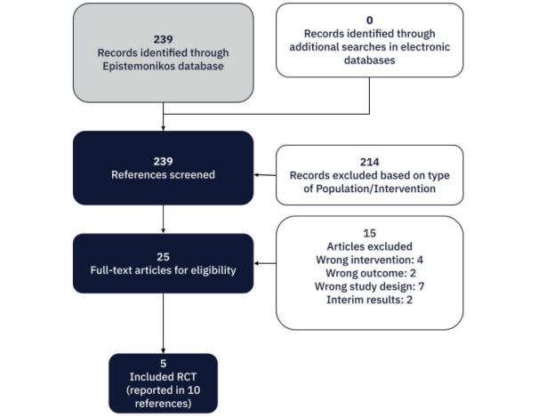
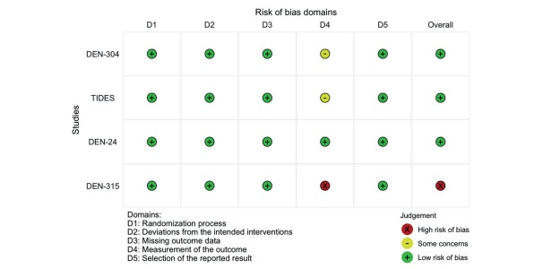

## Introducción

El dengue es una enfermedad viral transmitida por el mosquito Aedes
aegypti, que se ha convertido en uno de los principales desafíos de
salud pública a nivel global. Son los cuatro serotipos conocidos del
virus del dengue que circulan alrededor del mundo: DENV-1, DENV-2,
DENV-3 y DENV-4. La infección puede ser asintomática o provocar un
cuadro clínico que va desde fiebre leve hasta casos graves, como el
dengue grave (también conocido como dengue hemorrágico), que puede
comprometer órganos, provocar hemorragias severas e incluso la muerte.

Entre los síntomas más frecuentes se encuentran fiebre alta repentina,
dolores musculares y articulares intensos, dolor retroocular, erupciones
en la piel, náuseas y malestar general. En casos graves, la enfermedad
puede causar fuga de plasma, acumulación de líquidos, dificultad
respiratoria, sangrados y fallo multiorgánico.

A nivel mundial, el dengue ha mostrado una expansión sostenida en las
últimas décadas. Según la Organización Mundial de la Salud (OMS), se
estima que hay alrededor de 390 millones de infecciones por dengue cada
año, de las cuales aproximadamente 96 millones presentan manifestaciones
clínicas.

En Argentina, la situación es alarmante. En los últimos años, el país ha
experimentado brotes cada vez más frecuentes y de mayor magnitud,
especialmente en las provincias del norte y el centro, aunque también se
han registrado casos autóctonos en zonas donde antes no circulaba el
virus. La temporada 2023-2024 fue la más grave desde que se tiene
registro, lo que genera una preocupación creciente por la capacidad del
sistema de salud para dar respuesta y por la necesidad de estrategias
preventivas eficaces.

Una de las herramientas más prometedoras para el control del dengue es
el desarrollo de vacunas. Actualmente existen dos vacunas aprobadas para
su uso en algunos países: Dengvaxia (de Sanofi Pasteur), autorizada
desde 2015, y TAK-003 (de Takeda), aprobada más recientemente en la
Unión Europea y algunos países de América Latina. Sin embargo, ambas
presentan limitaciones: Dengvaxia solo se recomienda para personas que
ya han tenido una infección previa, debido a riesgos de agravamiento en
casos primoinfectados, mientras que TAK-003 ha mostrado mayor seguridad
y eficacia, pero aún está en proceso de evaluación en varios países.

A su vez, el Instituto Butantan en Brasil ha desarrollado su propia
vacuna contra el dengue, que actualmente se encuentra en etapas
avanzadas de estudio. Los ensayos clínicos de fase III han mostrado
resultados prometedores, y se espera que la vacuna sea autorizada
próximamente en Brasil y otros países de la región. Esta iniciativa
regional representa una oportunidad clave para mejorar el acceso a la
inmunización en América Latina y reducir la dependencia de laboratorios
internacionales.

El análisis de la situación epidemiológica del dengue y del estado
actual de las vacunas es crucial para comprender el alcance de esta
problemática, por este motivo vamos a analizar 2 estudios (una revisión
sistemática y un ensayo clínico) que resultan pertinentes y se hará una
evaluación de la situación actual de dicha enfermedad en Rosario, en
Santa Fe y en Argentina.

## Bengolea et al. (2024). *Effectiveness and safety of the tetravalent TAK-003 Dengue vaccine: a systematic review*.

### Revista de publicación

[Revista Medicina (Buenos Aires)](https://www.medicinabuenosaires.com/)

Medicina (Buenos Aires) es una revista bimestral, publicada con el apoyo
del CONICET (Consejo Nacional de Investigaciones Científicas y
Técnicas). La revista no tiene propósitos comerciales. El objeto de su
creación ha sido propender al adelanto de la medicina argentina. Los
beneficios que pudieran obtenerse serán aplicados exclusivamente a ese
fin. Acepta trabajos de investigación, clínica y experimental. Los
trabajos enviados para su publicación deben ser originales, si bien
pueden haber sido comunicados en sociedades científicas, en cuyo caso
corresponderá mencionarlo. La dirección se reserva el derecho de juzgar
los trabajos y/o remitirlos a árbitros.

### Factor de impacto

Los índices de impacto son un instrumento para comparar y evaluar la
importancia relativa de una revista determinada dentro de un mismo campo
científico en función del promedio de citas que reciben los artículos
por ella publicados durante un periodo determinado. El más conocido de
estos índices es el Factor de Impacto (FI).

El Factor de impacto de una revista en el año $y$, es el resultado de
dividir el número de citas que han recibido en este año $y$ los
artículos de esa revista publicados en los dos años anteriores, entre el
número de artículos publicados en dicha revista en esos dos años.

$$ FI_y = \frac{Citaciones_y}{Publicaciones_{y-1}+Publicaciones_{y-2}} $$

El factor de impacto de la revista es de **0.6** en 2023, según [WoS
Journal Info](https://wos-journal.info/journalid/1116) y [VU
Library](https://journalpublishingguide.vu.nl/WebQuery/vubrowser/15503#:~:text=Scopus%20Journal%20Metrics%20(2024)%20*%20SJR:%200.197.%20*%20SNIP:%200.267.%20*%20CiteScore:%200.9).

### Objetivo del estudio

Realizar una revisión sistemática para evaluar la efectividad y
seguridad de la vacuna TAK-003 tetravalente contra el dengue, en
pacientes sanos (niños y adultos), independientemente de su estado de
exposición previa al virus.

### Diseño del estudio

**Preguntas PICO:**

-   Pacientes (P): Pacientes sanos (niños y adultos), independientemente
    de su estado previo de exposición al virus del dengue.
-   Intervención (I): Vacuna atenuada tetravalente contra el dengue
    TAK-003.
-   Comparador (C): Placebo.
-   Resultados (O):

-- Mortalidad: definida como mortalidad por cualquier causa

-- Infección grave por dengue: según los criterios de la Organización
Mundial de la Salud

-- Infección por dengue: diagnóstico mediante reacción en cadena de la
polimerasa (PCR) en un paciente con fiebre y síntomas compatibles

-- Dengue hemorrágico: pacientes diagnosticados con dengue y
trombocitopenia, o shock, o signos de sangrado

-- Eventos adversos graves: según la definición de los estudios
primarios

-- Eventos adversos: según la definición de los estudios primarios

**Búsqueda de los datos:** todas las búsquedas abarcaron el período
desde la fecha de creación de cada base de datos hasta el 18/12/2023,
sin restricciones de fecha de publicación, estado de publicación ni
idioma. La identificación de estudios primarios se complementó con una
búsqueda específica en la base de datos PubMed.

**Selección de estudios:** dos investigadores independientes (AB, CS)
evaluaron los títulos y resúmenes de todos los artículos de acuerdo con
los criterios de elegibilidad para población, intervención, comparación
y diseño del estudio. Se obtuvo el texto completo de todos los estudios
potencialmente elegibles, y dos investigadores (AB, CS) evaluaron su
elegibilidad. Cualquier desacuerdo fue resuelto mediante discusión y, de
ser necesario, se involucró a un tercer revisor (AI).

**Extracción de los datos:** se recopiló información detallada sobre las
características demográficas, la metodología del estudio, la población
incluida, las intervenciones realizadas, la comparación utilizada y los
resultados reportados.

### Criterios de inclusión/exclusión

Se encontraron 239 ensayos clínicos en la base de datos de Epistemonikos
que cumplen las características mencionadas en las preguntas PICO. Luego
de esta selección inicial, se fueron excluyendo ensayos a partir de los
siguientes criterios de exclusión:

-   Diseño de estudio incorrecto.

-   Intervención incorrecta.

-   Variable respuesta incorrecta.

-   Población incorrecta.

-   Resultados provicionales.

Finalmente, se incluyeron 5 ensayos clínicos que cumplian todos los
criterios para trabajar en esta revisión sistemática.

A continuación, se presenta el diagrama de flujo PRISMA:

### Metodología estadística

- Para el análisis de variables dicotómicas, se expresó la estimación del impacto terapéutico de la intervención mediante medidas de riesgo junto con el IC del 95%.

- Para el análisis de variables continuas, se utilizó la diferencia de medias y la desviación estándar, también con su IC del 95%.

- Se empleó el método de variancia inversa y un modelo de efectos aleatorios, para analizar estudios clínicamente homogéneos.

- La homogeneidad se evaluó mediante la prueba ꭕ² y la estadística I² con un nivel de significación del 10%.

- Se evaluó la certeza de la evidencia utilizando la metodología GRADE.

### Resultados

#### Mortalidad

En un ensayo clínico, que incluyó un total de 20.067 participantes de entre 4 y 16 años, se informó que el efecto de la vacuna tetravalente contra el dengue sobre la mortalidad es incierto. RR=1.25, IC 95%=[0.22 ; 6.44].

La certeza de la evidencia fue clasificada como muy baja. Al haber una baja tasa de eventos en ambos grupos del estudio, se puede pensar que es un evento poco frecuente.

#### Infección grave por dengue

En un ensayo clínico con 20.067 participantes de entre 4 y 16 años, se reportó que el uso de la vacuna contra el dengue se asoció con evidencia de alta certeza en la reducción del riesgo de infección grave por virus del dengue. RR=0.17,  IC 95%=[0,12 ; 0,24].

Tanto en Argentina (riesgo basal de infección grave por dengue 170 por cada 100.000 pacientes) como en Puerto Rico (4.990 por cada 100.000 pacientes), la certeza de la evidencia fue clasificada como alta y el uso de la vacuna TAK-003 resultaría en una disminución de infecciones graves entre niños y adolescentes de 4 a 16 años.

#### Fiebre hemorrágica

En un ensayo clínico con 20.067 participantes de entre 4 y 16 años, el uso de la vacuna contra el dengue se asoció con evidencia de baja certeza en la reducción del riesgo de desarrollar fiebre hemorrágica. RR=0.35, IC 95%=[0.15 ; 0.81].

La certeza de la evidencia fue clasificada como baja, principalmente por la imprecisión derivada del bajo número de eventos en cada grupo, lo cual introduce fragilidad en los resultados.

#### Infección por dengue

Tres ensayos clínicos con un total de 22.221 participantes sanos entre 4 y 16 años, reportaron evidencia de alta certeza sobre la reducción de infecciones por dengue asociadas con el uso de la vacuna. RR=0.40, IC 95%=[0.36 ; 0.45], I²=0%.

Tanto en Argentina (riesgo basal de infección por virus del dengue 256 por cada 100.000 pacientes) como en Brasil (1.383 por cada 100.000 pacientes), la certeza de la evidencia fue clasificada como alta y el uso de la vacuna tetravalente contra el dengue resultaría en una disminución de infecciones entre niños y adolescentes de 4 a 16 años.

#### Eventos adversos graves

Cinco ensayos clínicos con un total de 23.540 participantes,  reportaron evidencia de baja certeza sobre un posible aumento de eventos adversos graves asociados al uso de la vacuna contra el dengue. RR=1.04, IC 95%=[0.69 ; 1.55], I²=25%.

#### Eventos adversos de cualquier tipo

Tres ensayos clínicos con un total de 21.348 participantes, predominantemente niños o adolescentes, reportaron evidencia de baja certeza sobre un posible aumento de eventos adversos de cualquier tipo asociados al uso de la vacuna contra el dengue. RR=1.41, IC 95%=[0.79 ; 2.52], I²=94,6%.

### Posibles sesgos

Se consideraron como posibles los siguientes sesgos:

- Sesgo en el proceso de aleatorización.

- Sesgo en la medición de las variables respuestas.

- Sesgo en la selección del resultado comunicado.

- Sesgo debido a desviaciones de las intervenciones previstas.

- Sesgo por falta de datos de resultados.

Tres ensayos fueron considerados con bajo riesgo de sesgo, uno presentó algunas consideraciones y otro mostró un alto riesgo de sesgo. Estos riesgos de sesgo se evaluaron usando la herramienta Cochrane Rob 2.

